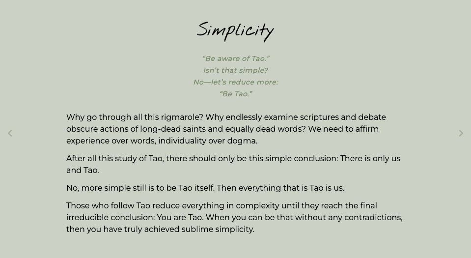

# Daily Tao

[](LICENSE)



Read from a selection of daily meditations written by Deng Ming-Dao.

This project was inspired by a desire to read the passages for the current day when travelling without the book.

## Table of Contents

- [Installation](#installation)
- [Usage](#usage)
- [Deploy](#deploy)

## Installation

To get started with the project, follow these steps:

1. Clone the repository:

```bash
git clone https://github.com/NickBlomberg/daily-tao.git
```

2. Navigate to the project directory:

```bash
cd daily-tao
```

3. Install dependencies

```bash
npm install
```

## Usage

To run the Next.js application, use the following command:

```bash
npm run dev
```

Visit http://localhost:3000 in your browser to view the application.

## Deploy

This project can be deployed to Vercel using this button.

[](https://vercel.com/new/clone?repository-url=https%3A%2F%2Fgithub.com%2FNickBlomberg%2Fdaily-tao&project-name=daily-tao&repository-name=daily-tao)
